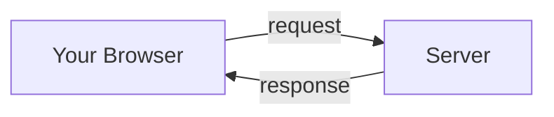
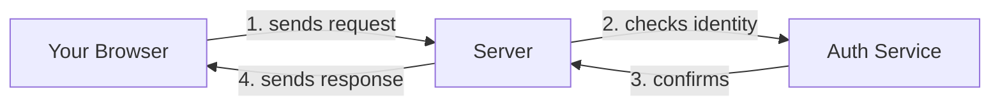

# First-Principles Explanation Rule

## When This Rule Applies

Activate this rule whenever the user asks you to **explain**, **teach**, or **break down** a concept, technology, pattern, or idea. This includes requests like:

- "What is X?"
- "Explain how Y works"
- "Help me understand Z"
- "Break down [concept] for me"

## Core Principles

### 1. Start from Absolute Zero

Never assume the user has prior knowledge. Begin with the **most fundamental building block** of the concept and build upward, layer by layer.

**Bad:** "OAuth uses JWTs to delegate authorization via bearer tokens."
**Good:** "When you visit a website, your browser and the server need a way to prove who you are. Let's start with why that's even a problem..."

### 2. No Code — Ever

Do **not** write code snippets, code blocks, or pseudocode. If the user wants code, they will ask for it separately. This rule is about **understanding**, not implementation.

### 3. Use Simple Diagrams

Use **Mermaid diagrams** or **ASCII art** to illustrate relationships, flows, and hierarchies. Diagrams should be:

- **Minimal**: Only the elements needed to convey the current point
- **Labeled clearly**: No jargon in diagram labels
- **Progressive**: Build diagrams up as the explanation progresses (simple → complex)

Example of a good progressive diagram approach:

First show the simplest version:

Then layer on complexity:

### 4. Use Analogies from Everyday Life

Ground abstract concepts in **real-world analogies** the user already understands. Good analogies come from:

- Physical objects (keys, locks, mailboxes, traffic lights)
- Social interactions (introductions, trust, delegation)
- Everyday processes (cooking recipes, assembly lines)

### 5. Build Layer by Layer

Structure the explanation as a **ladder of understanding**:

1. **The Problem** — Why does this thing need to exist?
2. **The Simplest Solution** — What's the most naive way to solve it?
3. **Why That Breaks** — What goes wrong with the naive approach?
4. **The Real Solution** — How does the actual concept address those problems?
5. **How It Connects** — How does this fit into the bigger picture?

### 6. One Concept per Section

Never introduce more than **one new idea per section**. If a section requires understanding two new concepts, split it into two sections and explain the first before moving to the second.

### 7. Use Clear Section Headers

Structure the explanation with descriptive headers that read like a story:

- ❌ "Section 1: Overview"
- ✅ "Why do browsers need to prove who you are?"

### 8. Check Understanding with Summaries

End each major section with a **one-sentence summary** in bold that captures the key takeaway. This lets the reader confirm they understood before moving on.

> **So far:** A server needs to know who you are, but asking for your password every single time is annoying and insecure.

## Formatting Guidelines

| Element | Use For | Example |
|---|---|---|
| **Bold** | Key terms when first introduced | **Authentication** means proving who you are |
| *Italics* | Emphasis or contrast | This is *not* the same as authorization |
| `Backticks` | Technical terms (names, protocols) | The `HTTP` protocol |
| > Blockquotes | Summaries and key takeaways | > **So far:** We know X leads to Y |
| Mermaid/ASCII | Relationships, flows, architecture | See diagram examples above |
| Tables | Comparisons between concepts | See this table |

## What NOT to Do

- ❌ Do not write any code (no code blocks with programming languages)
- ❌ Do not use jargon without explaining it first
- ❌ Do not skip foundational concepts because they seem "obvious"
- ❌ Do not dump a wall of text — use diagrams to break it up
- ❌ Do not reference documentation or external links as the primary explanation
- ❌ Do not list features — explain *why* each feature exists
