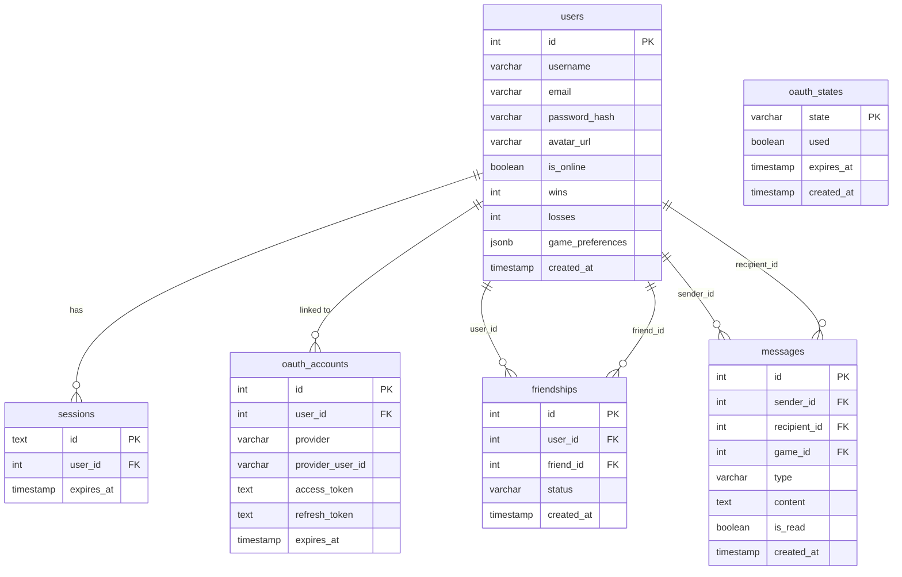
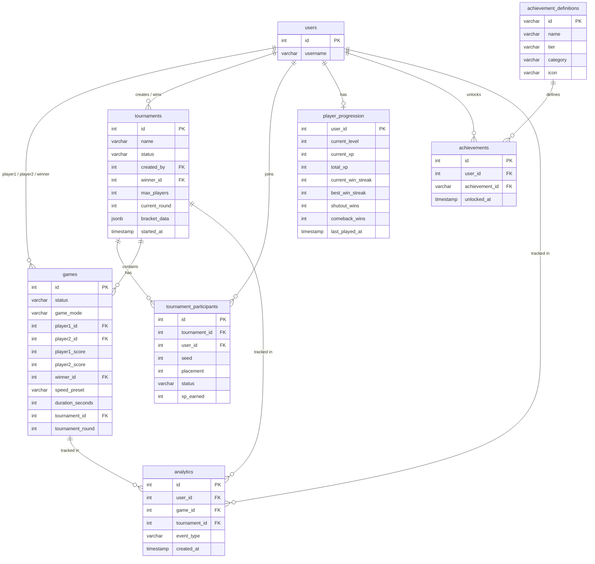

*This project has been created as part of the 42 curriculum by keramos-, kbolon, jadyar, fdunkel.*

# ft_transcendence 🏓
A real-time multiplayer Pong game built with Svelte.

---

# Description

ft_transcendence is a full-stack web application centered around a modern implementation of the classic Pong game.
The project is developed as part of the 42 curriculum and focuses on real-time interaction, clean architecture, security, and extensibility through modular design.

Players can compete in live Pong matches, manage user profiles, and participate in tournaments.
The project is designed to evolve through optional modules such as AI opponents, matchmaking, statistics, and advanced user interaction.

We chose SvelteKit as our full-stack framework to keep frontend and backend logic within a single, coherent codebase.

SvelteKit provides:
- File-based routing
- Server-side endpoints
- Excellent performance with minimal boilerplate
---

# Key Features

- Real-time Pong gameplay
- Multiplayer support
- User authentication & profiles
- Tournament-ready architecture
- Dockerized development environment
- Secure, modular, and extensible design

---

## Technical Stack

### Frontend & Backend
- **SvelteKit**
- **TypeScript**
- **Vite** is used as the build tool and dev server for fast iteration.
- Modern component-based architecture
- Responsive & accessible UI
- Backend endpoints via SvelteKit
- WebSockets for real-time gameplay
- Secure authentication & input validation
- **Drizzle ORM** provides type-safe database access and schema management.
- **Lucia** is used for authentication, offering a secure and framework-agnostic auth solution that integrates cleanly with SvelteKit.
- Internationalization (i18n). The application supports multiple languages using svelte-i18n.
All user-facing text is externalized into translation files and can be switched at runtime via the UI.

### Database
- **PostgreSQL**
- Separate production and test databases
- Clear relational schema

### DevOps
- **Docker & Docker Compose**
- Environment-based configuration (.env)
- One-command startup

## Project Structure (High-Level)
```text
.
├── src/
│   ├── routes/                 # SvelteKit routes (pages + API endpoints)
│   │   ├── (api)/              # API route groups (auth, etc.)
│   │   ├── (legal)/            # Privacy Policy & Terms
│   │   ├── dashboard/          # Authenticated user pages
│   │   ├── profile/            # User profile pages
│   │   └── +layout.svelte      # Root layout
│   │
│   ├── lib/
│   │   ├── component/          # Reusable UI components
│   │   ├── server/             # Backend logic (auth, DB access)
│   │   │   ├── auth/           # Lucia authentication
│   │   │   └── db/             # Database access & helpers
│   │   ├── store/              # Client-side state stores
│   │   └── assets/             # Static assets (icons, logos)
│   │
│   ├── db/
│   │   └── schema/             # Drizzle ORM database schemas
│   │
│   ├── hooks.server.ts         # Global request hooks
│   ├── app.html                # HTML template
│   └── app.d.ts                # Type definitions
│
├── static/                     # Static public files (robots.txt, etc.)
├── drizzle.config.ts           # Drizzle ORM configuration
├── compose.yml                 # Docker Compose setup
├── Makefile                    # Convenience commands
├── scripts/                    # Utility scripts
├── e2e/                        # Playwright end-to-end tests
├── package.json                # Project dependencies
└── README.md
```

---
# Instructions

## Prerequisites

| Tool | Minimum version |
|------|----------------|
| Docker | 20+ |
| Docker Compose | v2+ |
| Make | any |
| Node.js | 20+ |
| npm | 9+ |

## Configuration

Copy the environment templates:

```bash
cp .env.example .env
cp .env.example .env.test
```

Edit `.env` and fill in the required values:

| Variable | Description |
|----------|-------------|
| `DATABASE_URL` / `DB_URL` | PostgreSQL connection string (default works out of the box) |
| `GITHUB_CLIENT_ID` / `GITHUB_CLIENT_SECRET` | GitHub OAuth app credentials |
| `FORTYTWO_CLIENT_ID` / `FORTYTWO_CLIENT_SECRET` | 42 School OAuth app credentials |
| `OAUTH_ENCRYPTION_KEY` | 64-character hex key used to encrypt stored OAuth tokens |

> OAuth credentials are only required if you want to use third-party login. The app works without them using email/password auth.

## Running the Project

```bash
make start
```

This single command will:
1. Start the PostgreSQL production and test databases via Docker
2. Install Node.js dependencies
3. Push the Drizzle schema to the database
4. Start the SvelteKit dev server at `http://localhost:5173`

## Useful Commands

```bash
make test          # Run the full test suite against the isolated test DB
make re            # Full clean + restart (fclean → start)
make build         # Build the SvelteKit app for production
make preview       # Preview the production build locally
make dev           # Start only the dev server (DBs must already be up)
make db-push       # Push Drizzle schema changes to the production DB
make db-studio     # Open Drizzle Studio UI for the production DB
make db-reset      # Drop and recreate the production DB
make db-seed       # Seed the production DB with initial data
make fclean        # Full clean: containers, volumes, and node_modules
```

---

# Testing
Dedicated test database (db_test)
Tests are isolated from production data

Ports:
- PostgreSQL (production): localhost:5432
- PostgreSQL (test): localhost:5433
---

# Team Information

| Name | GitHub | Role | Responsibilities |
|------|--------|------|-----------------|
| Karen | kbolon | Product Owner | Vision, feature prioritization, validation |
| Finn | fdunkel | Project Manager | Planning, coordination, deadlines |
| Barbara | keramos- | Technical Lead | Architecture, stack decisions, reviews |
| James | jadyar | Technical Lead | Architecture, stack decisions, reviews |
| Finn, Karen, James, Barbara | — | Developers | Feature implementation, testing |

---

# Project Management
Task tracking via GitHub Issues
Feature branches with pull requests
Regular team syncs
Code reviews before merging

---

# Implemented Features

| Feature | Description | Team Member(s) |
|---------|-------------|----------------|
| **Pong game engine** | Canvas-based 2D Pong (`src/lib/game/gameEngine.ts`) running at 60 FPS. Clients simulate physics locally (paddles, ball, spin mechanics). Three play modes: Local (same device), Computer (vs AI), Online (remote). Three speed presets: chill / normal / fast. | kbolon |
| **Power-up system** | 9 power-up types implemented: `bigPaddle`, `smallPaddle`, `speedBall`, `slowBall`, `reverseControls`, `freeze`, `invisibleBall`, `wall`, `magnet`. Positive effects help the collector; negative effects hurt the opponent. Visual timer bars shown under the affected player's score. | jadyar, keramos |
| **Visual effects & themes** | Effect presets (`none`, `subtle`, `arcade`, `spectacle`, `custom`) with trail particles, screen shake, speed lines, chromatic aberration, and freeze frames (`src/lib/game/effectsEngine.ts`). 10+ field themes in dark and pastel categories (`src/lib/game/themes.ts`). | keramos |
| **Ball skins** | 12+ ball skins with unique trail styles: glow, flame, sparkle, zap, rainbow, pixel, ghost, void. Configured via `src/lib/game/ballSkins.ts` and rendered in `src/lib/game/ballSkinRenderer.ts`. | keramos |
| **Remote 1v1 gameplay** | `GameRoom` (`src/lib/server/socket/game/GameRoom.ts`) runs the authoritative game loop at 60 FPS, manages both players' state, and broadcasts updates. 5-second reconnection grace period before a disconnect is registered; 15-second timeout before the room is closed. | keramos |
| **Matchmaking queue** | `MatchmakingQueue` (`src/lib/server/socket/game/MatchmakingQueue.ts`) with three modes: `quick` (normal settings), `wild` (randomized settings at match time), `custom` (player-defined). Scoring algorithm pairs players by speed and score compatibility. Tier escalation: exact match (0–45 s) → flexible (45–90 s) → open (90 s+). | keramos, jadyar |
| **Game invites** | Players can challenge friends directly. Invites expire after 30 seconds. Managed via `src/lib/server/socket/handlers/game.ts`. | keramos |
| **Tournament system** | Single-elimination brackets for 4, 8, or 16 players (`src/lib/server/tournament/`). `TournamentManager.ts` orchestrates bracket generation, match creation, winner advancement, and forfeit handling. `bracket.ts` handles seeding and round progression. Bracket data stored as JSON; real-time updates via Socket.IO. Players earn XP based on placement. | keramos, jadyar |
| **AI opponent** | Three difficulty levels: Homer (easy), Bart (medium), Lisa (hard). Each level has a distinct error margin and reaction time. AI is deliberately imperfect to allow human wins. Compatible with all power-ups and game customization options. | kbolon, fdunkel, keramos, jadyar |
| **User registration & login** | Email + password authentication. Passwords hashed with Argon2 via `@node-rs/argon2`. Sessions managed by Lucia v3 with HTTP-only cookies and a Drizzle/PostgreSQL adapter (`src/lib/server/auth/lucia.ts`). | kbolon, keramos |
| **OAuth 2.0 — GitHub & 42 School** | Full OAuth 2.0 flow for both GitHub and 42 School (`src/routes/(api)/(auth)/login/github/` and `/login/42/`). Tokens encrypted with AES-256-GCM before storage in the `oauth_accounts` table (`src/lib/server/auth/oauth.ts`). Session unified with the Lucia auth layer after OAuth callback. | jadyar |
| **User profiles** | Profile pages (`src/routes/(users_profile)/profile/`) display avatar, username, level/XP bar, win/loss stats, match history, and unlocked achievements. Accessible from any friend card or leaderboard entry. | jadyar |
| **Avatar upload & defaults** | Users can upload a custom avatar (POST `/api/profile/avatars/uploads`) or choose from a gallery of defaults (GET `/api/avatars/defaults`). Stored at `static/avatars/uploads/`. | keramos |
| **Friends system** | Send, accept, decline, cancel, and remove friend requests. Block/unblock users (blocking prevents messaging). Search users by username. All managed via REST endpoints under `/api/friends/` and the `friendships` table. | keramos |
| **Real-time online presence** | When a user connects or disconnects, Socket.IO broadcasts `friend:online` / `friend:offline` events to all their accepted friends. A 5-second grace period avoids false offline signals on tab switches. | keramos, fdunkel |
| **Direct messaging (chat)** | 1-on-1 real-time chat between friends via Socket.IO (`src/lib/server/socket/handlers/chat.ts`). Messages capped at 500 characters. Blocked users cannot message each other. Messages persist in the `messages` table with read/unread tracking. Chat works during active games. | keramos |
| **Unread message counts** | GET `/api/chat/unread` returns per-friend unread counts, surfaced as badges in the UI. | jadyar |
| **XP & leveling system** | Every game awards XP (`src/lib/server/progression/xp.ts`): Win = 50, Loss = 20, plus bonuses for shutouts (+15), win streaks (+5/win, capped at 25), speed (+10 fast / +5 normal), close game (≤2 point diff, +10), comebacks (+20), and ball returns (+1 per 5). Leveling uses exponential growth `50 × 1.3^level` up to level 100. | funkel |
| **Achievement system** | 21 achievements across 5 categories: Shutout (bronze/silver/gold), Win Streak, Match Count, Scorer, Comeback, Rally (`src/lib/server/progression/achievements.ts`). Checked after every game; unlocked achievements stored in the `achievements` table and displayed on profile pages. | fdunkel, keramos |
| **Leaderboard** | Global leaderboard at `/leaderboard` ranking players by XP/level using the `player_progression` table. | keramos |
| **Match history** | Every game result persisted in the `games` table (player IDs, scores, winner, speed preset, duration, tournament round). Accessible at `/match-history`. | keramos, fdunkel |
| **Settings** | Users can update email (`/api/settings/email`), password (`/api/settings/password`), notification preferences, and game preferences (default speed, effects, sound, ball skin, theme) via `/api/settings/`. | keramos, kbolon |
| **60+ reusable UI components** | Components organized in `src/lib/component/` across categories: Pong, Matchmaking, Progression, Tournament, Chat, Effects, Friends, Customization, and Common. Styled with Tailwind CSS 4. Includes ambient background effects (`AmbientBackground`, `Aurora`, `Starfield`, `NoiseGrain`). | keramos |
| **Privacy Policy & Terms of Service** | Accessible legal pages under `src/routes/(legal)/`, linked from the footer on all pages. | kbolon |
| **Dockerized one-command startup** | `make start` spins up two PostgreSQL containers (prod :5432, test :5433), installs dependencies, pushes the schema, and starts the Vite dev server. `compose.yml` manages all services. | keramos, kbolon |

---

# Modules

**Total: 25 points** — 8 Major modules (16 pts) + 9 Minor modules (9 pts)

## Web — 8 pts

| # | Module | Type | Pts | Justification & Implementation |
|---|--------|------|-----|-------------------------------|
| W1 | Full-stack Framework | Major | 2 | **Why:** SvelteKit is a true full-stack framework with file-based routing, SSR, and server-only modules — it covers both the frontend (Svelte 5 components, Tailwind CSS) and the backend (API routes under `src/routes/api/`, server hooks, Drizzle DB access). Chosen because it keeps frontend and backend in one coherent codebase with no duplication. **How:** Pages load data via `+page.server.ts` files with direct DB access. REST mutations go through `src/routes/api/**`. The global request hook `src/hooks.server.ts` validates Lucia sessions and sets `locals.user` on every request. |
| W2 | Real-time WebSockets | Major | 2 | **Why:** Live Pong gameplay, matchmaking, chat, and friend presence all require sub-100 ms bidirectional communication. **How:** Socket.IO 4 server (`src/lib/server/socket/index.ts`) is attached to the Vite dev server via a custom Vite plugin (`vite.config.ts`). Auth middleware (`src/lib/server/socket/auth.ts`) validates sessions before any event is processed. Handlers in `src/lib/server/socket/handlers/` cover game events, chat, friends, and tournaments. Connection and disconnection are handled with grace periods to avoid spurious state changes. |
| W3 | User Interaction | Major | 2 | **Why:** The module requires a chat system, profile system, and friends system — all three are fully implemented. **How:** Chat is real-time via Socket.IO with persistent storage in the `messages` table (500-char limit, block enforcement, in-game support). Profiles are rendered at `src/routes/(users_profile)/profile/` with stats, match history, and achievements. Friends management uses 7 REST endpoints under `/api/friends/` backed by the `friendships` table (pending / accepted / blocked states). |
| W4 | ORM for Database | Minor | 1 | **Why:** Drizzle ORM gives type-safe SQL queries and schema-as-code, preventing entire classes of bugs at compile time. **How:** Schema defined in `src/db/schema/` (13 tables with check constraints, unique constraints, and cascades). The Drizzle client is a singleton in `src/lib/server/db/index.ts`. Migrations generated with `npm run db:generate` and applied with `npm run db:migrate`; numbered SQL files live in `drizzle/`. |
| W5 | Custom Design System | Minor | 1 | **Why:** A consistent, reusable component library improves development speed and visual coherence across all pages. **How:** 60+ Svelte components in `src/lib/component/` organized by domain (Pong, Matchmaking, Progression, Tournament, Chat, Customization, Common). Color palette and typography are defined in Tailwind CSS 4 config. Icon set used consistently across cards, badges, and modals. Ambient effects (`Aurora`, `Starfield`, `NoiseGrain`, `AmbientBackground`) provide a unified visual identity. |


## User Management — 4 pts

| # | Module | Type | Pts | Justification & Implementation |
|---|--------|------|-----|-------------------------------|
| U1 | Standard User Management & Auth | Major | 2 | **Why:** Core requirement — secure identity, profile management, avatar, and social features. **How:** Lucia v3 manages sessions via HTTP-only cookies with a Drizzle/PostgreSQL adapter. Passwords hashed with Argon2 (`src/lib/server/auth/password.ts`). Users update profile info and password via `/api/settings/`. Custom and default avatars managed via `/api/profile/avatars/`. Friend online status shown in real-time via Socket.IO presence events. Profile pages at `src/routes/(users_profile)/profile/`. |
| U2 | Game Statistics & Match History | Minor | 1 | **Why:** Players need feedback on their progress; evaluators verify stat tracking across games. **How:** Every game result is written to the `games` table (scores, winner, speed, duration, tournament context). The `player_progression` table tracks wins, losses, best streak, shutouts, comebacks, total points, and ball returns. The `/match-history` route and `/leaderboard` route surface this data. Match history also shows achievement unlocks with timestamps. |
| U3 | Remote Authentication (OAuth 2.0) | Minor | 1 | **Why:** Reduces friction for users who already have a GitHub or 42 School account. **How:** Full OAuth 2.0 authorization code flow for both **GitHub** (`/login/github/`) and **42 School** (`/login/42/`). After callback, the provider token is encrypted with AES-256-GCM and stored in `oauth_accounts`. The Lucia session is then created identically to password auth. `src/lib/server/auth/oauth.ts` handles token storage and retrieval; `src/lib/server/auth/token-encryption.ts` handles encryption. |

## Artificial Intelligence — 2 pts

| # | Module | Type | Pts | Justification & Implementation |
|---|--------|------|-----|-------------------------------|
| AI1 | AI Opponent | Major | 2 | **Why:** Gives solo players a challenging, replayable opponent without requiring another human online. **How:** Three difficulty levels — **Homer** (easy), **Bart** (medium), **Lisa** (hard) — each configured with a distinct error margin and reaction time. The AI is deliberately imperfect: it misses balls within its error range to simulate human-like play. It handles all game customization options (power-ups, speed presets, themes). Implemented inside `src/lib/game/gameEngine.ts` alongside the physics simulation, so it naturally interacts with the same ball and paddle state as a human player. |

## Gaming and User Experience — 10 pts

| # | Module | Type | Pts | Justification & Implementation |
|---|--------|------|-----|-------------------------------|
| G1 | Web-based Pong Game | Major | 2 | **Why:** Core deliverable of the project — a fully playable, browser-based game with clear win/loss conditions. **How:** Canvas-based 2D Pong in `src/lib/game/gameEngine.ts` running at 60 FPS. Clients simulate physics locally (paddles, ball spin). Three play modes: Local (same device), Computer (AI), Online (remote via Socket.IO). Synthesized sounds (`soundEngine.ts`), visual effects (`effectsEngine.ts`), and ball skins (`ballSkins.ts`) all integrated into the engine. |
| G2 | Remote Players | Major | 2 | **Why:** Enables two players on different machines to compete in real time, which is the primary competitive use case. **How:** `GameRoom` (`src/lib/server/socket/game/GameRoom.ts`) runs the authoritative server-side game loop. Paddle positions are synced via `game:input` events; the server broadcasts `game:state` to both clients. Disconnections are handled with a 5-second grace period (reconnection window) and a 15-second hard timeout before the room is closed and a winner declared. `RoomManager.ts` creates, tracks, and cleans up rooms with a 1-hour TTL. |
| G3 | Multiplayer Tournament (3+ Players) | Major | 2 | **Why:** Supporting more than two players requires a bracket system where multiple people compete in an organised structure simultaneously. **How:** Single-elimination tournaments for 4, 8, or 16 players (`src/lib/server/tournament/TournamentManager.ts`). The tournament manager generates the full bracket with seeding (`bracket.ts`), creates individual `GameRoom` instances per match, advances winners automatically, handles forfeits with a queue to prevent race conditions, and supports spectators after elimination. Unlimited concurrent tournaments supported. Real-time bracket state pushed to all participants via Socket.IO `tournament:state-update`. |
| G4 | Advanced Chat Features | Minor | 1 | **Why:** Enhances the basic chat required by the User Interaction module with richer functionality. **How:** Beyond simple send/receive, the chat system supports: in-game messaging (messages linked to a `game_id`), two message types (`chat` and `system`), per-conversation unread counts exposed via `/api/chat/unread`, block enforcement (blocked users cannot exchange messages), real-time delivery to all active sockets of the recipient, and persistent history retrievable via GET `/api/chat/[friendId]`. |
| G5 | Tournament System | Minor | 1 | **Why:** Organized competition between multiple players requires bracket generation, match scheduling, and result propagation. **How:** `TournamentManager.ts` and `bracket.ts` in `src/lib/server/tournament/` handle the full lifecycle: creation, player join/leave, bracket generation, match-by-match result recording, winner advancement, forfeit resolution, and final placement. Tournament data persisted in `tournaments` and `tournament_participants` tables. UI components in `src/lib/component/` (Bracket, MatchCard, TournamentLobby, OutcomeChampion, etc.) render the bracket in real time. |
| G6 | Game Customization | Minor | 1 | **Why:** Gives players agency over how the game looks and feels, increasing replayability. **How:** Before each game, players configure speed preset (chill / normal / fast), enable/disable and select from 9 power-ups, choose from 10+ field themes (`src/lib/game/themes.ts`), pick a ball skin with a trail style (`src/lib/game/ballSkins.ts`), and set visual effect intensity (`effectsEngine.ts`). Sound volume and mute are adjustable in-game. Preferences are persisted per user in the `users.game_preferences` JSON column and restored on next session. The AI opponent respects all customization options. |
| G7 | Gamification System | Minor | 1 | **Why:** Rewarding players for their actions encourages engagement and long-term retention. **How:** `src/lib/server/progression/` processes every game result. XP is awarded with bonuses for shutouts, win streaks, speed, close games, comebacks, and ball returns. An exponential leveling curve (`50 × 1.3^level`, up to level 100) is computed in `xp.ts`. 21 achievements across 6 categories (Shutout, Streak, Match Count, Scorer, Comeback, Rally) are evaluated in `achievements.ts` after every game and stored in the `achievements` table. Level-up and achievement-unlock events are surfaced in the UI via toast notifications and the `LevelUpModal` component. |

---

# Database Schema (Overview)

### Identity & Social



### Gameplay & Progression


---

# Security & Best Practices
- HTTPS-ready architecture
- Input validation on frontend & backend
- Password hashing
- Secrets managed via .env
- No credentials committed to Git

---

# Use of AI Tools
AI tools were used for:
- Documentation drafting and refinement
- High-level architecture discussions
- Debugging assistance
- Code refactoring and exploring alternative solutions after the team had spent days working through a problem without success

---

# Resources
- SvelteKit Documentation
- PostgreSQL Documentation
- Docker & Docker Compose Docs
- WebSocket specifications
---

# Notes
Compatible with latest Chrome
No console errors or warnings
Privacy Policy & Terms of Service are included and accessible in the app
Built with teamwork, curiosity, and a lot of late-night debugging and coffee...so much coffee 🏓
