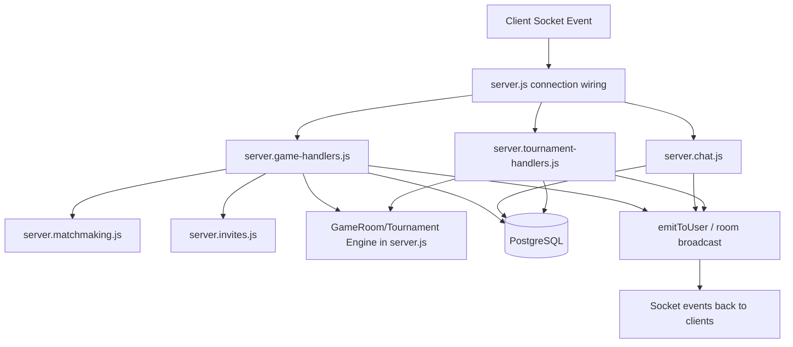

# Server Modules Map

This document explains how realtime server responsibilities are split after the `server.js` refactor.

## Entry Point

- [server.js](/home/j/Desktop/Transcendence/server.js)
Purpose:
- Bootstraps HTTP + Socket.IO
- Provides shared infra helpers (`emitToUser`, presence, auth middleware)
- Hosts core tournament/game room engine state and progression persistence logic
- Wires handler modules into each socket connection

## Socket Handler Modules

- [server.game-handlers.js](/home/j/Desktop/Transcendence/server.game-handlers.js)
Purpose:
- Registers all `game:*` socket handlers
- Handles invites, room join, paddle input, forfeits, queue join/leave/status
- Delegates queue mechanics to matchmaking module and invite lifecycle to invite module

- [server.chat.js](/home/j/Desktop/Transcendence/server.chat.js)
Purpose:
- Registers all `chat:*` socket handlers
- Persists chat messages and read receipts
- Performs block/friend checks before message delivery

- [server.tournament-handlers.js](/home/j/Desktop/Transcendence/server.tournament-handlers.js)
Purpose:
- Registers `tournament:*` socket handlers
- Creates/joins/leaves/cancels/starts tournaments
- Uses injected tournament engine functions from `server.js`

## Domain Utility Modules

- [server.matchmaking.js](/home/j/Desktop/Transcendence/server.matchmaking.js)
Purpose:
- Queue state + matching algorithm (wild/custom/quick, compatibility scoring, scan, expiry)
- Exposes small API: `add/remove/has/size/position/entries/friendsInQueue/scan/removeExpired`

- [server.invites.js](/home/j/Desktop/Transcendence/server.invites.js)
Purpose:
- Invite lifecycle state + timeout management
- Exposes API: `create/accept/decline/cancelBySender/removeByUser`

## Dependency Direction

Keep this rule:
- `server.js` can import helper modules.
- Helper modules should not import `server.js`.
- Handler modules receive dependencies via arguments (dependency injection), not globals.

## Editing Guide

If you need to change...
- Matchmaking rules: edit `server.matchmaking.js`
- Invite expiration/cancel behavior: edit `server.invites.js`
- `game:*` socket flow: edit `server.game-handlers.js`
- `chat:*` socket flow: edit `server.chat.js`
- `tournament:*` socket flow: edit `server.tournament-handlers.js`
- Tournament bracket engine / game-room persistence / progression save: edit `server.js`

## Runtime Flow Diagram

## Game Match Lifecycle

```mermaid
flowchart LR
    A[Player A sends game:invite] --> B[server.game-handlers.js]
    B --> C[server.invites.js create timeout]
    C --> D[Player B receives invite]
    D --> E[Player B sends game:invite-accept]
    E --> F[createGameRoom in server.js]
    F --> G[Emit game:start to both players]
    G --> H[Both clients send game:join-room]
    H --> I[Server GameRoom starts 60Hz tick]
    I --> J[Emit game:state snapshots]
    J --> K[Client renders/interpolates]
    I --> L[game over/forfeit]
    L --> M[persist match + progression in server.js]
    M --> N[Emit game:progression + game:over]
    N --> O[Clients show results/XP]
```

