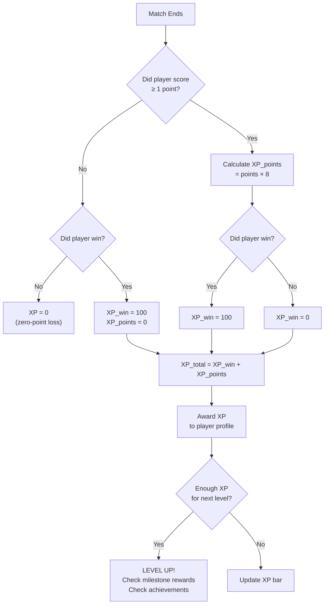
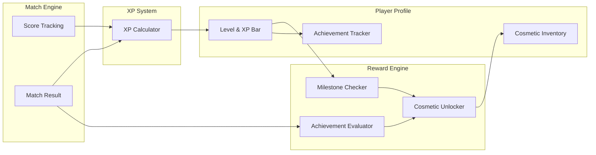

# Pong — Player Profile Progression System

> A complete, implementation-ready specification for player leveling, XP earning, and achievements.

---

## 1. System Overview

- Players earn **XP** from two sources: **winning matches** (primary) and **scoring individual points** (secondary).
- XP accumulates toward a **25-level** progression system with a smooth polynomial curve and plateau phases before major milestones.
- An **achievement system** with Bronze / Silver / Gold tiers rewards skill, engagement, and mastery across four categories.
- Players who lose a match with **zero points scored** receive **no XP** — this prevents AFK farming.

---

## 2. XP Mechanics

### 2.1 Earning Formula

After each match, XP is calculated as:

```
XP_earned = XP_win + XP_points
```

| Component | Formula | Description |
|---|---|---|
| **XP_win** | `100` if winner, `0` if loser | Flat reward for winning the match |
| **XP_points** | `points_scored × 8` | Per-point reward regardless of outcome |

> **Zero-point loss rule**: If the player **loses** and scored **0 points**, `XP_earned = 0`.

### 2.2 Worked Examples

**Example A — Decisive Winner**
- Player wins, scores 11 points → `100 + (11 × 8)` = **188 XP**

**Example B — Close Loss**
- Player loses, scores 9 points → `0 + (9 × 8)` = **72 XP**

**Example C — Shutout Loss**
- Player loses, scores 0 points → **0 XP** (zero-point loss rule)

---

## 3. Level Progression

### 3.1 XP Curve Formula

The XP required **to advance from level N to level N+1** follows a polynomial curve with built-in plateaus:

```
XP_to_next(N) = floor(50 × N^1.6) + plateau_bonus(N)
```

**Plateau bonus** adds extra XP before milestone levels (5, 10, 15, 20, 25) to create a sense of anticipation:

| Level | Plateau Bonus |
|---|---|
| 4, 9, 14, 19, 24 | +150 XP |
| All others | +0 XP |

### 3.2 Full Level Table

| Level | XP to Next Level | Cumulative XP | Approx. Matches to Level¹ |
|---|---|---|---|
| 1 | 50 | 0 | — |
| 2 | 151 | 50 | 1 |
| 3 | 287 | 201 | 2 |
| 4 | 598 | 488 | 4 |
| 5 ⭐ | 569 | 1,086 | 8 |
| 6 | 727 | 1,655 | 12 |
| 7 | 903 | 2,382 | 17 |
| 8 | 1,097 | 3,285 | 23 |
| 9 | 1,459 | 4,382 | 30 |
| 10 ⭐ | 1,535 | 5,841 | 40 |
| 11 | 1,779 | 7,376 | 51 |
| 12 | 2,041 | 9,155 | 63 |
| 13 | 2,319 | 11,196 | 76 |
| 14 | 2,762 | 13,515 | 92 |
| 15 ⭐ | 2,926 | 16,277 | 110 |
| 16 | 3,252 | 19,203 | 130 |
| 17 | 3,594 | 22,455 | 152 |
| 18 | 3,951 | 26,049 | 176 |
| 19 | 4,474 | 30,000 | 203 |
| 20 ⭐ | 4,729 | 34,474 | 233 |
| 21 | 5,145 | 39,203 | 265 |
| 22 | 5,575 | 44,348 | 300 |
| 23 | 6,019 | 49,923 | 338 |
| 24 | 6,629 | 55,942 | 378 |
| 25 ⭐ | MAX | 62,571 | 423 |

> ¹ Approximate matches assumes an average of **148 XP/match** (55% win rate, ~9 points scored per match).
> ⭐ = Milestone level with special rewards.

### 3.3 Pacing Summary

| Phase | Levels | Feel | Matches Required |
|---|---|---|---|
| **Onboarding** | 1–4 | Fast, rewarding | ~4 per level |
| **Early Game** | 5–9 | Steady growth | ~6–7 per level |
| **Mid Game** | 10–14 | Noticeable challenge | ~9–12 per level |
| **Late Game** | 15–19 | Committed players | ~14–18 per level |
| **Endgame** | 20–25 | Prestige, mastery | ~22–30 per level |

---

## 4. Achievement System

All achievements are organized into four categories with three tiers each.

### 4.1 Skill-Based Achievements

| Achievement | Tier | Unlock Criteria |
|---|---|---|
| **Shutout** | 🥉 Bronze | Win a match without opponent scoring (11-0) |
| **Shutout Artist** | 🥈 Silver | Win 5 shutout matches (career total) |
| **Perfect Machine** | 🥇 Gold | Win 10 shutout matches (career total) |
| **Comeback Kid** | 🥉 Bronze | Win a match after trailing by 5+ points |
| **Never Say Die** | 🥈 Silver | Win 5 comeback matches (trailing by 5+) |
| **Reverse Sweep** | 🥇 Gold | Win a match after trailing 0-9 |
| **Hot Streak** | 🥉 Bronze | Win 3 matches in a row |
| **On Fire** | 🥈 Silver | Win 7 matches in a row |
| **Unstoppable** | 🥇 Gold | Win 15 matches in a row |
| **Clutch Player** | 🥉 Bronze | Win a match that reached 10-10 |
| **Ice in Veins** | 🥈 Silver | Win 5 matches that reached 10-10 |
| **Nerves of Steel** | 🥇 Gold | Win 15 matches that reached 10-10 |

### 4.2 Milestone-Based Achievements

| Achievement | Tier | Unlock Criteria |
|---|---|---|
| **First Steps** | 🥉 Bronze | Reach Level 5 |
| **Rising Star** | 🥈 Silver | Reach Level 15 |
| **Pixie Unicorn** | 🥇 Gold | Reach Level 25 |
| **Point Collector** | 🥉 Bronze | Score 500 career points |
| **Point Machine** | 🥈 Silver | Score 5,000 career points |
| **Point God** | 🥇 Gold | Score 25,000 career points |
| **Contender** | 🥉 Bronze | Win 25 matches |
| **Veteran** | 🥈 Silver | Win 100 matches |
| **Champion** | 🥇 Gold | Win 500 matches |

### 4.3 Mechanical Mastery Achievements

| Achievement | Tier | Unlock Criteria |
|---|---|---|
| **The Wall** | 🥉 Bronze | Return 500 balls in career |
| **Iron Curtain** | 🥈 Silver | Return 2,500 balls in career |
| **Impenetrable** | 🥇 Gold | Return 10,000 balls in career |
| **Speed Demon** | 🥉 Bronze | Win a match in under 90 seconds |
| **Lightning Round** | 🥈 Silver | Win 5 matches in under 90 seconds |
| **Blitz Master** | 🥇 Gold | Win 20 matches in under 90 seconds |

### 4.4 Engagement Achievements

| Achievement | Tier | Unlock Criteria |
|---|---|---|
| **Getting Started** | 🥉 Bronze | Play 10 matches |
| **Regular** | 🥈 Silver | Play 100 matches |
| **Dedicated** | 🥇 Gold | Play 500 matches |
| **Daily Player** | 🥉 Bronze | Play on 3 consecutive days |
| **Weekly Warrior** | 🥈 Silver | Play on 7 consecutive days |
| **Marathon Runner** | 🥇 Gold | Play on 30 consecutive days |

---

## 5. Milestone Rewards

At each milestone level, players unlock a tangible reward. These create anticipation during the plateau phases at levels 4, 9, 14, 19, and 24.

| Level | Milestone | Reward |
|---|---|---|
| **5** | 🌱 Rookie | **Paddle Color: Electric Blue** — unlocks custom paddle color selector |
| **10** | ⚡ Competitor | **Profile Badge: Bronze Shield** + **Trail Effect: Spark** — ball leaves a subtle spark trail |
| **15** | 🔥 Challenger | **Paddle Skin: Neon Glow** + **Profile Badge: Silver Shield** |
| **20** | 💎 Elite | **Victory Animation: Fireworks** + **Profile Badge: Gold Shield** + **Profile Banner: Flame** |
| **25** | 🦄 Pixie Unicorn | **Exclusive Title: "Pixie Unicorn"** + **Profile Badge: Pink Unicorn** + **Pink Unicorn Paddle Skin** + **Trail Effect: Rainbow Sparkle** + **All trail effects unlocked** |

> [!IMPORTANT]
> Rewards are **cosmetic only** — no gameplay advantage is given at any level. This ensures competitive fairness.

---

## 6. Progression Flow Diagram

### 6.1 XP Award Flow (Per Match)



### 6.2 Full System Architecture



### 6.3 Progression Curve Visualization

```
XP to Next Level
│
6,600 ┤                                                    ╭──
      │                                                 ╭──╯
5,500 ┤                                              ╭──╯
      │                                           ╭──╯
4,500 ┤                                        ╭──╯
      │                                  ╭─▲──╯    ▲ = plateau
3,500 ┤                              ╭──╯
      │                          ╭──╯
2,500 ┤                   ╭─▲──╯
      │               ╭──╯
1,500 ┤          ╭─▲──╯
      │       ╭──╯
  500 ┤  ╭─▲─╯
      │──╯
    0 ┼────────────────────────────────────────────────────
      1  2  3  4  5  6  7  8  9 10 11 12 13 14 15 16 17 18 19 20 21 22 23 24 25
                                    Level
```

---

## 7. Implementation Checklist

> [!NOTE]
> This section is for the developer's reference — it lists the data points and systems needed to implement this spec.

### Data to Track Per Player
- `current_level` (1–25)
- `current_xp` (within current level)
- `total_xp` (lifetime)
- `total_wins`, `total_losses`, `total_points_scored`
- `current_win_streak`, `best_win_streak`
- `consecutive_days_played`, `last_played_date`
- `total_ball_returns`
- `shutout_wins`, `comeback_wins`, `deuce_wins`
- `unlocked_achievements[]` (with unlock timestamp)
- `unlocked_cosmetics[]`

### Per-Match Data Needed
- `winner_id`, `loser_id`
- `winner_score`, `loser_score`
- `match_duration_seconds`
- `ball_returns_per_player`
- `max_deficit_before_win` (for comeback tracking)
- `reached_deuce` (boolean, did score reach 10-10)
